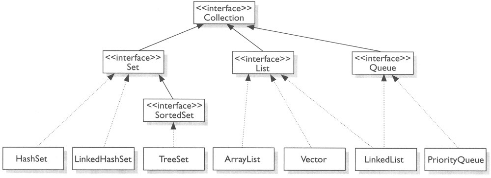
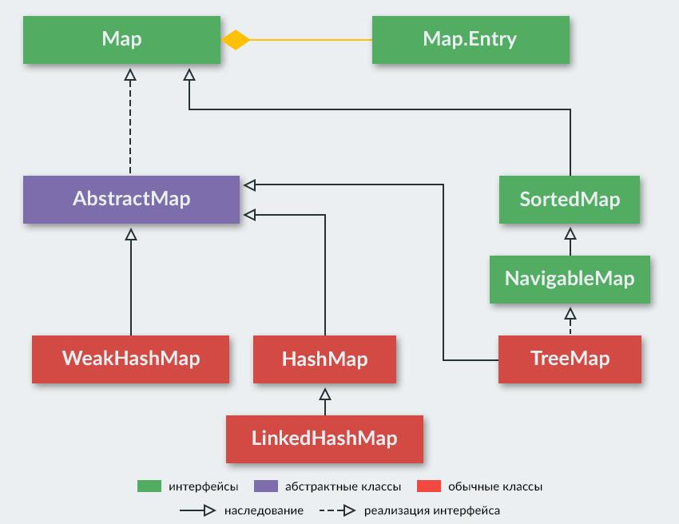
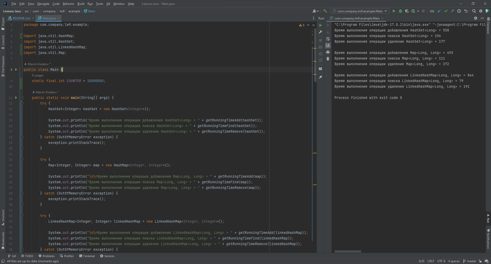

# Отчёт по лабораторной работе №9 «Исследование возможностей коллекций в языке программирования Java»

***УрФУ ИРИТ-РФТ  
В рамках изучения дисциплины  
«Программирование на Java»  
Студента группы РИЗ-200016у  
Кулакова Максима Ивановича***

***Преподаватель Архипов Николай Александрович***

## Цель работы
Исследование возможностей коллекций в языке программирования
Java, сравнение коллекций по времени выполнения операций, знакомство с
реализацией коллекций.

## Описание задачи
- Изучение справочного материала;
- Описание классов коллекций и методов работы с ними;
- Сравнения времени операций с коллекциями;
- Ответ на контрольные вопросы;
- Оформление отчёта по лабораторной работе.

## Ход работы
Вариант №10 -> Коллекции `HashSet`, `Map`, `LinkedHashMap`.

### 1. Общее описание коллекций в Java
Все классы коллекций реализовывают интерфейс `Collection`. Сам интерфейс
`Collection` расширяет интерфейс `Interable`, благодаря которому все коллекции
можно перебирать в цикле for-each. Основными реализациями его являются:
- `Set` - используется для хранения множеств уникальных объектов;
- `List` - представляет функциональность простых списков;
- `Queue` - представляет функционал для структур данных в виде очереди;
- `SortedSet` - расширяет интерфейс Set для создания сортированных коллекций
- `ArrayList` - простой список объектов
- `LinkedList` - представляет связанный список
- `TreeSet` - набор отсортированных объектов в виде дерева
- `HashSet` - набор объектов или хеш-множество, где каждый элемент имеет 
  ключ - уникальный хеш-код;
- и т.д.

Методы `Collection<E>`:

| Функция                                       | Описание                                                                                                                                                                                    |
|-----------------------------------------------|---------------------------------------------------------------------------------------------------------------------------------------------------------------------------------------------|
| `boolean add(E item)`                         | Добавляет в коллекцию объект `item`. При удачном добавлении возвращает `true`, при неудачном - `false`.                                                                                     |
| `boolean addAll(Collection<? extends E> col)` | Добавляет в коллекцию все элементы из коллекции `col`. При удачном добавлении возвращает `true`, при неудачном - `false`.                                                                   |
| `void clear()`                                | Удаляет все элементы из коллекции.                                                                                                                                                          |
| `boolean contains (Object item)`              | Возвращает `true`, если объект `item` содержится в коллекции, иначе возвращает `false`.                                                                                                     |
| `boolean isEmpty()`                           | Возвращает `true`, если коллекция пуста, иначе возвращает `false`.                                                                                                                          |
| `Iterator<E> iterator()`                      | Возвращает объект `Iterator` для обхода элементов коллекции.                                                                                                                                |
| `boolean remove (Object item)`                | Возвращает `true`, если объект `item` удачно удален из коллекции, иначе возвращается `false`.                                                                                               |
| `boolean removeAll(Collection<?> col)`        | Удаляет все объекты коллекции `col` из текущей коллекции. Если текущая коллекция изменилась, возвращает `true`, иначе возвращается `false`.                                                 |
| `boolean retainAll(Collection<?> col)`        | Удаляет все объекты из текущей коллекции, кроме тех, которые содержатся в коллекции `col`. Если текущая коллекция после удаления изменилась, возвращает `true`, иначе возвращается `false`. |
| `int size()`                                  | Возвращает число элементов в коллекции.                                                                                                                                                     |
| `Object[] toArray()`                          | Возвращает массив, содержащий все элементы коллекции.                                                                                                                                       |



Интерфейс `Map` представляет собой структуру данных, которая содержит набор пар 
«ключ - значение». Данный интерфейс также называют интерфейсом отображений.
Основными реализациями его являются:
- `Hashmap` - структура данных в виде словаря, в котором каждый объект имеет 
  уникальный ключ и некоторое значение. Расширяет `Map` для применения вместе
  с ключами перечисляемого типа;
- `LinkedHashMap` - расширяет класс `HashMap`, разрешая интеграцию с вводом элементов 
  в определённом порядке;
- `Hashtable` - данные хранятся в формате массива. Каждое значение данных имеет 
  уникальное значение ключа;
- `TreeMap` - структура данных в виде дерева, где каждый элемент имеет уникальный ключ 
  и некоторое значение.



Методы `Map<K,V>`:

| Функция                                  | Описание                                                                         |
|------------------------------------------|----------------------------------------------------------------------------------|
| `int size()`                             | Возвращает количество пар в map.                                                 |
| `boolean isEmpty()`                      | Проверяет, пустой ли map.                                                        |
| `boolean containsKey(Object key)`        | Содержит ли map заданный ключ?                                                   |
| `boolean containsValue(Object value)`    | Содержит ли map заданное значение?                                               |
| `V get(Object key)`                      | Возвращает значение по ключу.                                                    |
| `V put(K key, V value)`                  | Устанавливает новое значение ключу. Метод возвращает старое значение или `null`. |
| `putAll(Map<? extends K, ? extends V> m` | Добавляет пары из другого map.                                                   |
| `void clear()`                           | Очищает map – удаляет все пары.                                                  |
| `Set<K>keySet()`                         | Возвращает Set из ключей.                                                        |
| `Collection<V>values()`                  | Возвращает коллекцию из значений.                                                |
| `Set<Map.Entry<K, V>>entrySet()`         | Возвращает множество (Set) пар.                                                  |

### 2. Описание коллекций в соответствии с вариантом
`HashSet` реализовывает интерфейс `Set`. Он основан на использовании 
хэш-таблиц, а также поддерживается с помощью экземпляра `HashMap` (имеет
закрытое поле `HashMap<E,Object> map`. Добавление, удаление и проверки наличия
элементов выполняется с помощью методов объекта map: `map.put(e, PRESENT)`, 
`map.remove(o)` и `map.containsKey(o)`, где `e` и `o` - передаваемые 
исходному методу объекты, а `PRESENT` - выступающий в качестве значения 
пустой объект-константа. Операции добавления, удаления или поиска в 
среднем будут выполняться за константное (О(1)) время. Элементы `HashSet`
хранятся неупорядоченно.

В интерфейсе `Map` методы добавления, удаления и поиска элементов 
не имеют реализации. Реализация хранения объектов и работы большинства 
методов выполняется реализующими интерфейс `Map`. Наиболее часто 
используемым классом являются `HashMap`. 

`LinkedHashMap` является подклассом `HashMap`. Для реализации упорядоченности
в нём переопределяется класс `Empty`. В него добавляются указатели до и после.
Как и LinkedList, у `LinkedHashMap` есть `header` - голова двусвязанного списка.

### 3. Сравнение коллекций в соответствии с вариантом
При сравнении времени выполнения операция над одним типом выполнялась 10000000.
Данное число ниже чем указанно в варианте, из-за того что появлялось исключение
`OutOfMemoryError`.

Так как интерфейс `Map` абстрактный, то вместо него использовался `HashMap`. Для
объектов отображений (то что является суперклассом `Map`) в качестве операции поиска 
использовалась операция проверки наличия ключа в коллекции. Для объектов от классов
реализующих `Map` время удаление или удаления одного объекта будет меньше одной миллисекунды
поэтому операции производятся для 10000000 объектов. 

| Коллекция       | Время добавления | Время удаления | Время поиска |
|-----------------|------------------|----------------|--------------|
| `HashSet`       | 558              | 177            | 196          |
| `Map`           | 493              | 272            | 111          |
| `LinkedHashMap` | 844              | 191            | 79           |



Класс `Main`:
```java
import java.util.HashMap;
import java.util.HashSet;
import java.util.LinkedHashMap;
import java.util.Map;

public class Main {
    static final int COUNTER = 10000000;

    public static void main(String[] args) {
        try {
            HashSet<Integer> hashSet = new HashSet<Integer>();

            System.out.println("Время выполнения операции добавления HashSet<Long> = " + getRunningTimeAdd(hashSet));
            System.out.println("Время выполнения операции поиска HashSet<Long> = " + getRunningTimeFind(hashSet));
            System.out.println("Время выполнения операции удаление HashSet<Long> = " + getRunningTimeRemove(hashSet));
        } catch (OutOfMemoryError exception) {
            exception.printStackTrace();
        }

        try {
            Map<Integer, Integer> map = new HashMap<Integer, Integer>();

            System.out.println("\n\rВремя выполнения операции добавления Map<Long, Long> = " + getRunningTimeAdd(map));
            System.out.println("Время выполнения операции поиска Map<Long, Long> = " + getRunningTimeFind(map));
            System.out.println("Время выполнения операции удаление Map<Long, Long> = " + getRunningTimeRemove(map));
        } catch (OutOfMemoryError exception) {
            exception.printStackTrace();
        }

        try {
            LinkedHashMap<Integer, Integer> linkedHashMap = new LinkedHashMap<Integer, Integer>();

            System.out.println("\n\rВремя выполнения операции добавления LinkedHashMap<Long, Long> = " + getRunningTimeAdd(linkedHashMap));
            System.out.println("Время выполнения операции поиска LinkedHashMap<Long, Long> = " + getRunningTimeFind(linkedHashMap));
            System.out.println("Время выполнения операции удаление LinkedHashMap<Long, Long> = " + getRunningTimeRemove(linkedHashMap));
        } catch (OutOfMemoryError exception) {
            exception.printStackTrace();
        }
    }

    //--------------------------------------------------------
    //--------------------------------------------- ДОБАВЛЕНИЕ

    private static long getRunningTimeAdd(HashSet<Integer> list){
        // Точка начала отсчёта времени выполнения программы
        long start = System.currentTimeMillis();

        // Блок кода в котором выполняется операция добавления
        for (int i = 0; i < COUNTER; i++) {
            list.add(i);
        }

        // Точка окончания отсчёта времени выполнения программы
        long end = System.currentTimeMillis();
        return end - start;
    }

    private static long getRunningTimeAdd(Map<Integer, Integer> list){
        long start = System.currentTimeMillis();

        for (int i = 0; i < COUNTER; i++) {
            list.put(i, i);
        }

        long end = System.currentTimeMillis();
        return end - start;
    }

    private static long getRunningTimeAdd(HashMap<Integer, Integer> list){
        long start = System.currentTimeMillis();

        for (int i = 0; i < COUNTER; i++) {
            list.put(i, i);
        }

        long end = System.currentTimeMillis();
        return end - start;
    }

    //--------------------------------------------------------
    //-------------------------------------------------- ПОИСК

    private static long getRunningTimeFind(HashSet<Integer> list){
        long start = System.currentTimeMillis();

        for (int i = 0; i < COUNTER; i++) {
            list.contains(i);
        }

        long end = System.currentTimeMillis();
        return end - start;
    }

    private static long getRunningTimeFind(Map<Integer, Integer> list){
        long start = System.currentTimeMillis();

        for (int i = 0; i < COUNTER; i++) {
            list.get(i);
        }

        long end = System.currentTimeMillis();
        return end - start;
    }

    private static long getRunningTimeFind(HashMap<Integer, Integer> list){
        long start = System.currentTimeMillis();

        for (int i = 0; i < COUNTER; i++) {
            list.containsKey(i);
        }

        long end = System.currentTimeMillis();
        return end - start;
    }

    //--------------------------------------------------------
    //----------------------------------------------- УДАЛЕНИЕ

    private static long getRunningTimeRemove(HashSet<Integer> list){
        long start = System.currentTimeMillis();

        for (int i = 0; i < COUNTER; i++) {
            list.remove(i);
        }

        long end = System.currentTimeMillis();
        return end - start;
    }

    private static long getRunningTimeRemove(Map<Integer, Integer> list){
        long start = System.currentTimeMillis();

        for (int i = 0; i < COUNTER; i++) {
            list.remove(i);
        }

        long end = System.currentTimeMillis();
        return end - start;
    }

    private static long getRunningTimeRemove(HashMap<Integer, Integer> list){
        long start = System.currentTimeMillis();

        for (int i = 0; i < COUNTER; i++) {
            list.remove(i);
        }

        long end = System.currentTimeMillis();
        return end - start;
    }
}
```

### 4. Ответы на вопрос в соответствии с вариантом
**Вопрос:** Какие есть способы перебора всех элементов List?
**Ответ:** 
1. С помощью цикла for:
```java
for (var item : list) {
    System.out.println(item.toString()); 
}
```
2. С помощью интерфейса `Iterator`:
```java
Iterator listIterator = list.iterator();

while(listIterator.hasNext()) {
    System.out.println(listIterator.next()); 
}
```
3. С помощью интерфейса `ListIterator`:
```java
ListIterator listIterator = list.listIterator();

while(listIterator.hasPrevious()) {
    System.out.println(listIterator.previous());
}

while(listIterator.hasNext()) {
    System.out.println(listIterator.next());
}
```

## Вывод
В ходе лабораторной работы были получены навыки работы с коллекциями, 
изучен общий теоретический материал по Java Collection Framework, 
а также было выполнено сравнение времени выполнения операций для различных 
коллекций. В результате лабораторной работы поставленная цель была выполнена, 
а поставленные задачи достигнуты.