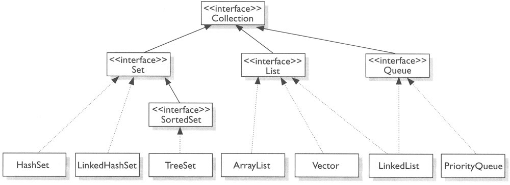
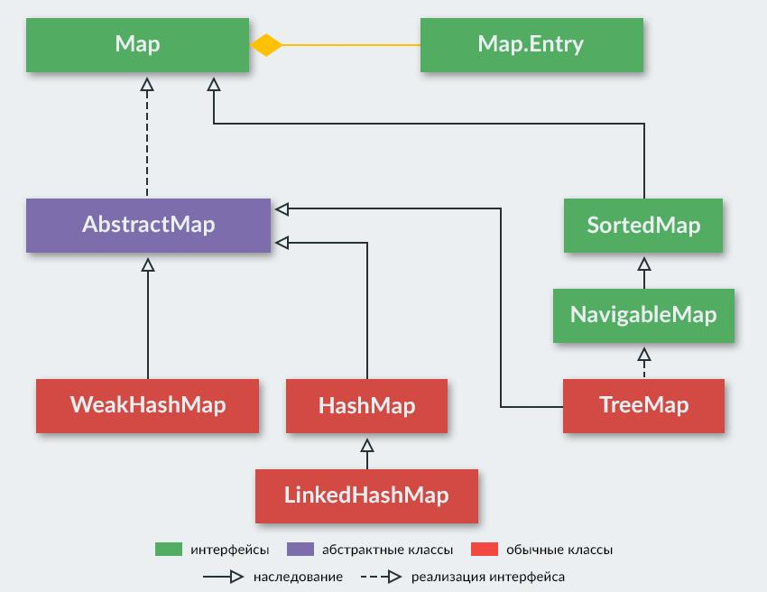

# Отчёт по лабораторной работе №9 «Исследование возможностей коллекций в языке программирования Java»

***УрФУ ИРИТ-РФТ  
В рамках изучения дисциплины  
«Программирование на Java»  
Студента группы РИЗ-200016у  
Кулакова Максима Ивановича***

***Преподаватель Архипов Николай Александрович***

## Цель работы
Исследование возможностей коллекций в языке программирования
Java, сравнение коллекций по времени выполнения операций, знакомство с
реализацией коллекций.

## Описание задачи
- Изучение справочного материала;
- Описание классов коллекций и методов работы с ними;
- Сравнения времени операций с коллекциями;
- Ответ на контрольные вопросы;
- Оформление отчёта по лабораторной работе.

## Ход работы
Вариант №10 -> Коллекции `HashSet`, `Map`, `LinkedHashMap`.

### 1. Общее описание коллекций в Java
Все классы коллекций реализовывают интерфейс `Collection`. Сам интерфейс
`Collection` расширяет интерфейс `Interable`, благодаря которому все коллекции
можно перебирать в цикле for bach. Основными реализациями его являются:
- `Set` - используется для хранения множеств уникальных объектов;
- `List` - представляет функциональность простых списков;
- `Queue` - представляет функционал для структур данных в виде очереди;
- `SortedSet` - расширяет интерфейс Set для создания сортированных коллекций
- `ArrayList` - простой список объектов
- `LinkedList` - представляет связанный список
- `TreeSet` - набор отсортированных объектов в виде дерева
- `HashSet` - набор объектов или хеш-множество, где каждый элемент имеет 
  ключ - уникальный хеш-код;
- и т.д.

Методы `Collection<E>`:

| Функция                                       | Описание                                                                                                                                                                                    |
|-----------------------------------------------|---------------------------------------------------------------------------------------------------------------------------------------------------------------------------------------------|
| `boolean add(E item)`                         | Добавляет в коллекцию объект `item`. При удачном добавлении возвращает `true`, при неудачном - `false`.                                                                                     |
| `boolean addAll(Collection<? extends E> col)` | Добавляет в коллекцию все элементы из коллекции `col`. При удачном добавлении возвращает `true`, при неудачном - `false`.                                                                   |
| `void clear()`                                | Удаляет все элементы из коллекции.                                                                                                                                                          |
| `boolean contains (Object item)`              | Возвращает `true`, если объект `item` содержится в коллекции, иначе возвращает `false`.                                                                                                     |
| `boolean isEmpty()`                           | Возвращает `true`, если коллекция пуста, иначе возвращает `false`.                                                                                                                          |
| `Iterator<E> iterator()`                      | Возвращает объект `Iterator` для обхода элементов коллекции.                                                                                                                                |
| `boolean remove (Object item)`                | Возвращает `true`, если объект `item` удачно удален из коллекции, иначе возвращается `false`.                                                                                               |
| `boolean removeAll(Collection<?> col)`        | Удаляет все объекты коллекции `col` из текущей коллекции. Если текущая коллекция изменилась, возвращает `true`, иначе возвращается `false`.                                                 |
| `boolean retainAll(Collection<?> col)`        | Удаляет все объекты из текущей коллекции, кроме тех, которые содержатся в коллекции `col`. Если текущая коллекция после удаления изменилась, возвращает `true`, иначе возвращается `false`. |
| `int size()`                                  | Возвращает число элементов в коллекции.                                                                                                                                                     |
| `Object[] toArray()`                          | Возвращает массив, содержащий все элементы коллекции.                                                                                                                                       |

Интерфейс `Map` представляет собой структуру данных, которая содержит набор пар 
«ключ - значение». Данный интерфейс также называют интерфейсом отображений.
Основными реализациями его являются:
- `Hashmap` - структура данных в виде словаря, в котором каждый объект имеет 
  уникальный ключ и некоторое значение. Расширяет `Map` для применения вместе
  с ключами перечисляемого типа;
- `LinkedHashMap` - расширяет класс `HashMap`, разрешая интеграцию с вводом элементов 
  в определённом порядке;
- `Hashtable` - данные хранятся в формате массива. Каждое значение данных имеет 
  уникальное значение ключа;
- `TreeMap` - структура данных в виде дерева, где каждый элемент имеет уникальный ключ 
  и некоторое значение.

Методы `Map<K,V>`:

| Функция                                  | Описание                                                                         |
|------------------------------------------|----------------------------------------------------------------------------------|
| `int size()`                             | Возвращает количество пар в map.                                                 |
| `boolean isEmpty()`                      | Проверяет, пустой ли map.                                                        |
| `boolean containsKey(Object key)`        | Содержит ли map заданный ключ?                                                   |
| `boolean containsValue(Object value)`    | Содержит ли map заданное значение?                                               |
| `V get(Object key)`                      | Возвращает значение по ключу.                                                    |
| `V put(K key, V value)`                  | Устанавливает новое значение ключу. Метод возвращает старое значение или `null`. |
| `putAll(Map<? extends K, ? extends V> m` | Добавляет пары из другого map.                                                   |
| `void clear()`                           | Очищает map – удаляет все пары.                                                  |
| `Set<K>keySet()`                         | Возвращает Set из ключей.                                                        |
| `Collection<V>values()`                  | Возвращает коллекцию из значений.                                                |
| `Set<Map.Entry<K, V>>entrySet()`         | Возвращает множество (Set) пар.                                                  |

### 2. Описание коллекций в соответствии с вариантом
Приведите описание реализации конкретной коллекции. (как работает
механизм добавления элементов, как работает механизм удаления элементов,
как работает механизм поиска элементов и т.д.)

Напишите конкретную вычислительную сложность добавления, удаления и
получения элементов в каждой коллекции в соответствии с вариантом;

Каким образом хранятся элементы в коллекции? (упорядочено или хаотично
и т.п.)

### 3. Сравнение коллекций в соответствии с вариантом
Необходимо произвести вычисление времени работы нижеперечисленных
операций, количество элементов коллекциях и сами коллекции указаны в
индивидуальном варианте. После выполнения вычислений необходимо
заполнить таблицы и привести скриншоты кода программы и данных вывода
в консоль.

Сравнение времени выполнения операции добавления:

| Коллекция       | В начало коллекции | В середину коллекции | В конец коллекции |
|-----------------|--------------------|----------------------|-------------------|
| `HashSet`       |                    |                      |                   |
| `Map`           |                    |                      |                   |
| `LinkedHashMap` |                    |                      |                   |

Сравнение времени выполнения операции удаления:

| Коллекция       | В начало коллекции | В середину коллекции | В конец коллекции |
|-----------------|--------------------|----------------------|-------------------|
| `HashSet`       |                    |                      |                   |
| `Map`           |                    |                      |                   |
| `LinkedHashMap` |                    |                      |                   |

Сравнение времени выполнения операции получения элемента по индексу:

| Коллекция       | По индексу для 10 000 000 000 элементов |
|-----------------|-----------------------------------------|
| `HashSet`       |                                         |
| `Map`           |                                         |
| `LinkedHashMap` |                                         |

### 4. Ответы на вопрос в соответствии с вариантом
**Вопрос:** Какие есть способы перебора всех элементов List?
**Ответ:** 

## Вывод
В ходе лабораторной работы были получены навыки работы с коллекциями, 
изучен общий теоретический материал по Java Collection Framework, 
а также было выполнено сравнение времени выполнения операций для различных 
коллекций. В результате лабораторной работы поставленная цель была выполнена, 
а поставленные задачи достигнуты.